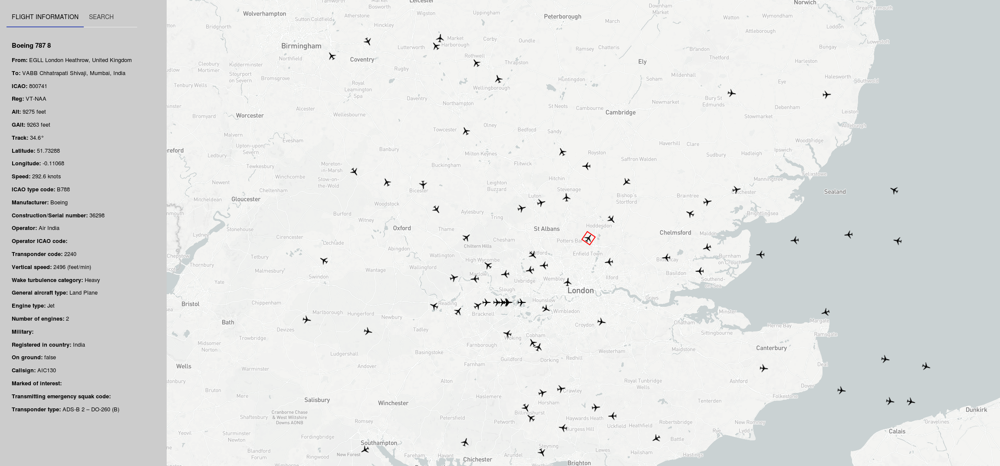

## Flight Tracker

Some code to answer the question about what all those people are doing in the sky.


### Server

The server is written in Go and can be started with the following:
```
go run main.go
```


### Client

You'll need to [sign up for a free mapbox account](https://www.mapbox.com/signup://www.mapbox.com/signup).

Once done, you'll receive an access token. Save that in the client root. 

```
echo 'REACT_APP_MAPBOX_TOKEN=your-token-goes-here' > .env.local
```

Then install the dependencies and start the app:

```
yarn && yarn start
```




